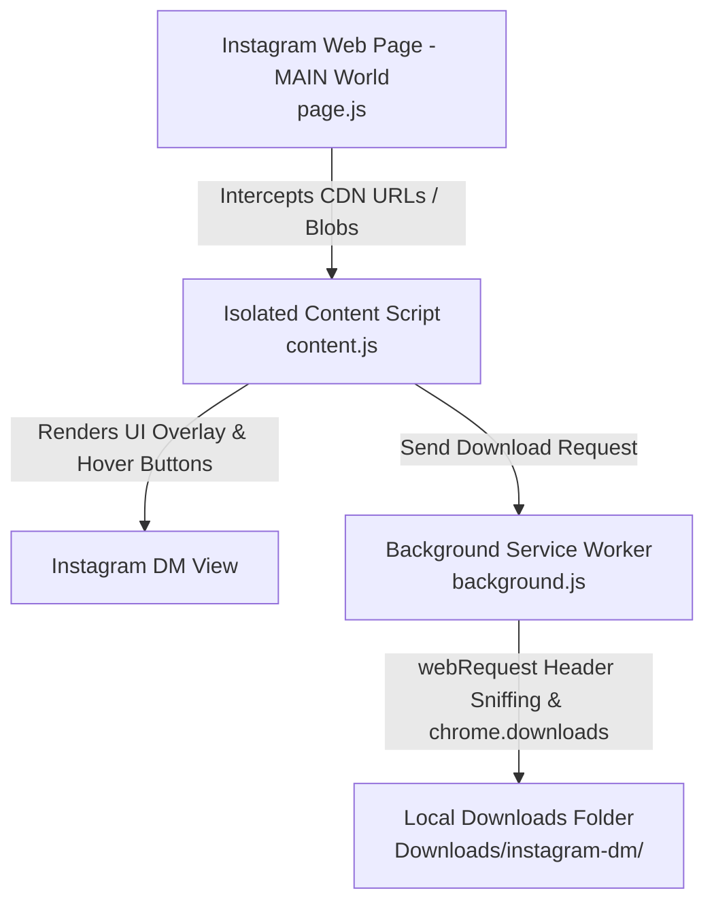

# Instagram DM Media Downloader

A Chrome Extension (Manifest V3) that enables downloading high-quality photos and videos directly from Instagram Direct Messages with a single click.

---

## 🌟 Features

- **One-Click Download**: Hover over any image or video in your Instagram DMs and click the **⬇** button overlay.
- **Real Video Stream Capture**: Intercepts video CDN network streams (`fetch`/`XHR`/`webRequest`), bypassing Instagram's default poster thumbnail limitation to download actual high-resolution `.mp4` video files.
- **Blob & MediaSource Fallback**: Uses a MAIN-world JavaScript bridge to extract media from `blob:` URLs when required.
- **Organized Storage**: Automatically saves downloaded media into `Downloads/instagram-dm/` with ISO timestamps for easy sorting.
- **Clean UI Overlay**: Minimalistic download button styling seamlessly integrated with Instagram's web interface.

---

## 🏗️ Architecture & How It Works

Instagram DMs render videos using complex blob streaming and dynamic poster elements (``), making standard media download extensions extract only static preview thumbnails. This extension solves that through a 3-part architecture:



1. **`page.js` (MAIN World Script)**:
   - Injected at `document_start` into the page's execution context.
   - Hooks `window.fetch` and `XMLHttpRequest` to capture real media CDN URLs (`.mp4`, `.mov`, etc.).
   - Converts `blob:` URLs to Data URLs when requested.
2. **`content.js` & `content.css` (Isolated Content Script)**:
   - Detects media containers in DM chat views and dynamically injects styled hover download buttons.
   - Communicates with `page.js` via `window.postMessage` bridge.
3. **`background.js` (Service Worker)**:
   - Sniffs response headers using `chrome.webRequest` to capture video URLs across Instagram CDN domains (`cdninstagram.com`, `fbcdn.net`).
   - Executes file downloads using the `chrome.downloads` API.

---

## 📂 Project Structure

```
instom/
├── manifest.json       # Manifest V3 extension configuration & permissions
├── background.js       # Background service worker (webRequest listener & downloads)
├── page.js             # MAIN-world script for network interception & blob extraction
├── content.js          # Content script handling DOM injection & event listeners
├── content.css         # UI overlay styles for the download button
├── popup.html          # Extension popup UI with instructions
├── icons/              # Extension icons (16x16, 48x48, 128x128)
└── README.md           # Documentation
```

---

## 🚀 Installation & Setup

1. **Download / Clone the Repository**:
   Clone or download this repository to your local machine.

2. **Open Chrome Extensions Page**:
   Navigate to `chrome://extensions` in your Chrome-based browser (Chrome, Brave, Edge, Opera).

3. **Enable Developer Mode**:
   Toggle the **Developer mode** switch in the top-right corner.

4. **Load Unpacked Extension**:
   Click **Load unpacked** in the top-left and select the directory containing this project.

---

## 💡 Usage

1. Navigate to [instagram.com/direct/inbox](https://www.instagram.com/direct/inbox/).
2. Open any conversation containing photos or videos.
3. Hover over the media item you want to save.
4. Click the **⬇** download button that appears over the media.
5. Check your `Downloads/instagram-dm/` folder for saved files.

---

## 🔒 Permissions & Security

- **`downloads`**: Required to save files directly to your machine.
- **`webRequest`**: Used strictly to detect incoming media URLs from Instagram's CDN servers.
- **Host Permissions**: Restricted to `instagram.com`, `*.cdninstagram.com`, and `*.fbcdn.net`.
- **Privacy Notice**: This extension operates entirely locally on your device. No user data, messages, credentials, or downloaded media are collected, logged, or transmitted anywhere.

---

## 📄 License

Distributed under the MIT License.
